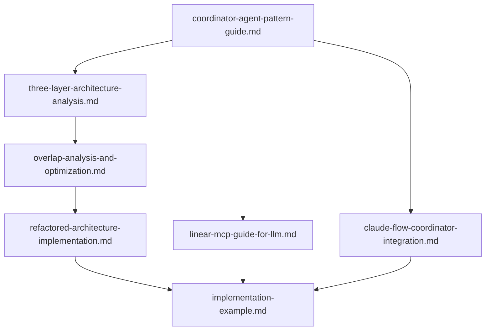

# 📚 项目文档快速导航

## 🎯 根据你的角色选择阅读路径

### 👨‍💼 **项目经理/产品经理**
**目标**: 了解项目价值和商业收益
```
1. 🏗️ refactored-architecture-implementation.md (理论基础和价值分析)
2. 📊 overlap-analysis-and-optimization.md (收益分析部分)
3. 🔗 claude-flow-coordinator-integration.md (商业价值部分)
```

### 👨‍💻 **技术架构师**
**目标**: 理解架构设计和技术决策
```
1. 🏗️ refactored-architecture-implementation.md (完整架构设计)
2. 📊 overlap-analysis-and-optimization.md (技术分析部分)
3. 🔗 claude-flow-coordinator-integration.md (技术架构部分)
```

### 👨‍🔧 **开发工程师**
**目标**: 掌握具体实现和代码示例
```
1. 📖 linear-mcp-guide-for-llm.md (工具使用)
2. 🏗️ refactored-architecture-implementation.md (代码实现部分)
3. 🔗 claude-flow-coordinator-integration.md (集成实现)
```

### 🤖 **AI/LLM工程师**
**目标**: 理解Agent协作和智能优化
```
1. 🏗️ refactored-architecture-implementation.md (理论基础和Agent协作)
2. 📖 linear-mcp-guide-for-llm.md (Agent协作部分)
3. 🔗 claude-flow-coordinator-integration.md (AI增强部分)
```

### 🔧 **DevOps/系统集成工程师**
**目标**: 了解部署和集成方案
```
1. 🔗 claude-flow-coordinator-integration.md (部署部分)
2. 🏗️ refactored-architecture-implementation.md (集成接口部分)
3. 📖 linear-mcp-guide-for-llm.md (工具集成)
```

## 🚀 根据你的目标选择阅读路径

### 🎯 **快速了解项目**
**时间**: 30分钟
```
1. docs/README.md (项目概览)
2. 📖 coordinator-agent-pattern-guide.md (前3章)
3. 💡 implementation-example.md (使用示例部分)
```

### 🏗️ **设计类似系统**
**时间**: 2-3小时
```
1. 🏗️ three-layer-architecture-analysis.md (架构分析)
2. 📊 overlap-analysis-and-optimization.md (设计思路)
3. 🏗️ refactored-architecture-implementation.md (实现方案)
4. 💡 implementation-example.md (参考实现)
```

### 💻 **实际开发实现**
**时间**: 4-6小时
```
1. 📖 linear-mcp-guide-for-llm.md (工具掌握)
2. 💡 implementation-example.md (完整示例)
3. 🏗️ refactored-architecture-implementation.md (代码实现)
4. 🔗 claude-flow-coordinator-integration.md (集成配置)
```

### 📊 **技术调研分析**
**时间**: 3-4小时
```
1. 📖 coordinator-agent-pattern-guide.md (理论基础)
2. 📊 overlap-analysis-and-optimization.md (技术分析)
3. 🔗 claude-flow-coordinator-integration.md (技术对比)
4. 🏗️ three-layer-architecture-analysis.md (可行性分析)
```

## 📋 文档依赖关系



## 🔍 按主题查找内容

### 🎭 **Coordinator Agent模式**
- 📖 `coordinator-agent-pattern-guide.md` - 完整指南
- 🏗️ `three-layer-architecture-analysis.md` - 设计层分析
- 💡 `implementation-example.md` - 实现示例

### ⚡ **Claude Flow Engine**
- 🔗 `claude-flow-coordinator-integration.md` - 深度分析
- 📊 `overlap-analysis-and-optimization.md` - 功能对比
- 🏗️ `refactored-architecture-implementation.md` - 集成方案

### 🔧 **Linear MCP**
- 📖 `linear-mcp-guide-for-llm.md` - 使用指南
- 💡 `implementation-example.md` - 集成示例
- 🏗️ `three-layer-architecture-analysis.md` - 工具层分析

### 🏗️ **架构设计**
- 🏗️ `three-layer-architecture-analysis.md` - 三层架构
- 🏗️ `refactored-architecture-implementation.md` - 重构方案
- 📊 `overlap-analysis-and-optimization.md` - 优化分析

### 💡 **实现和示例**
- 💡 `implementation-example.md` - 完整示例
- 🏗️ `refactored-architecture-implementation.md` - 代码实现
- 📖 `linear-mcp-guide-for-llm.md` - 工具使用

## ⏱️ 预估阅读时间

| 文档 | 页数 | 快速浏览 | 详细阅读 | 深度研究 |
|------|------|----------|----------|----------|
| coordinator-agent-pattern-guide.md | 55页 | 15分钟 | 45分钟 | 90分钟 |
| linear-mcp-guide-for-llm.md | 25页 | 8分钟 | 20分钟 | 40分钟 |
| three-layer-architecture-analysis.md | 45页 | 12分钟 | 35分钟 | 70分钟 |
| refactored-architecture-implementation.md | 35页 | 10分钟 | 25分钟 | 50分钟 |
| overlap-analysis-and-optimization.md | 20页 | 6分钟 | 15分钟 | 30分钟 |
| claude-flow-coordinator-integration.md | 40页 | 12分钟 | 30分钟 | 60分钟 |
| implementation-example.md | 15页 | 5分钟 | 12分钟 | 25分钟 |

## 🎯 推荐学习路径

### 🥇 **初学者路径** (总计约2小时)
1. 📖 coordinator-agent-pattern-guide.md (前半部分) - 30分钟
2. 📖 linear-mcp-guide-for-llm.md (基础部分) - 20分钟
3. 💡 implementation-example.md (完整) - 25分钟
4. 🏗️ refactored-architecture-implementation.md (概览) - 15分钟

### 🥈 **进阶路径** (总计约4小时)
1. 📖 coordinator-agent-pattern-guide.md (完整) - 45分钟
2. 🏗️ three-layer-architecture-analysis.md (详细) - 70分钟
3. 📊 overlap-analysis-and-optimization.md (完整) - 30分钟
4. 🏗️ refactored-architecture-implementation.md (详细) - 50分钟
5. 💡 implementation-example.md (深度) - 25分钟

### 🥉 **专家路径** (总计约6小时)
1. 所有文档完整阅读
2. 代码示例实际运行
3. 架构方案深度分析
4. 技术细节深入研究

## 📞 获取帮助

如果在阅读过程中遇到问题：

1. **概念不清楚**: 先查看 `coordinator-agent-pattern-guide.md` 的基础概念部分
2. **技术细节疑问**: 参考 `implementation-example.md` 的具体示例
3. **架构设计疑问**: 查看 `three-layer-architecture-analysis.md` 的详细分析
4. **实施问题**: 参考 `refactored-architecture-implementation.md` 的实施指导

---

**提示**: 建议使用支持Mermaid图表的Markdown阅读器以获得最佳阅读体验。
