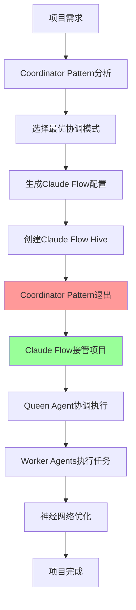

# Coordinator Pattern + Claude Flow 完整实现方案

## 📚 理论基础

### 什么是Coordinator Pattern？
Coordinator Pattern是一种**项目启动配置模式**，专门用于分析项目需求并生成最优的多Agent协作配置。与传统的持续协调不同，它采用"**一次性顾问**"的工作模式。

### 核心特征
- 🎯 **项目分析专家** - 深度分析项目需求和约束条件
- 📋 **配置生成器** - 生成Claude Flow的最优初始配置
- ⚡ **一次性工作** - 配置生成完成后立即退出
- 🔄 **理论指导** - 基于多Agent协作的最佳实践

### 与传统协调模式的区别
```
传统Coordinator Agent:
项目启动 → 持续协调 → 任务分配 → 状态管理 → 项目完成

优化后的Coordinator Pattern:
项目需求 → 分析配置 → 生成配置 → 移交Claude Flow → 退出
                                    ↓
                            Claude Flow接管全生命周期
```

## 🎯 新架构设计

### 优化后的三层架构
```
┌─────────────────────────────────────────────────────────┐
│        配置层 - Coordination Patterns Library           │
│     (模式定义、最佳实践、配置模板、决策规则)                  │
│              ⚠️ 仅在项目启动时参与                        │
├─────────────────────────────────────────────────────────┤
│      执行层 - Enhanced Claude Flow Engine               │
│    (统一协调、任务执行、状态管理、神经网络优化)               │
│              ✅ 项目全生命周期负责                         │
├─────────────────────────────────────────────────────────┤
│          工具层 - Linear MCP Integration                │
│              (项目管理和状态同步)                         │
└─────────────────────────────────────────────────────────┘
```

### 🔄 **关键设计原则：Coordinator Pattern的"一次性"角色**

**重要澄清**: Coordinator Pattern只在项目启动阶段发挥作用，生成Claude Flow配置后即退出，项目执行期间完全由Claude Flow接管。

#### **角色生命周期对比**
| 阶段 | Coordinator Pattern | Claude Flow Engine |
|------|-------------------|-------------------|
| **项目分析** | ✅ 分析需求，选择模式 | ❌ 不参与 |
| **配置生成** | ✅ 生成Claude Flow配置 | ❌ 不参与 |
| **系统初始化** | ✅ 指导Hive创建 | ✅ 接收配置，创建Hive |
| **项目执行** | ❌ 完全退出 | ✅ 完全接管 |
| **运行时协调** | ❌ 不参与 | ✅ Queen Agent负责 |
| **动态优化** | ❌ 不参与 | ✅ 神经网络优化 |

#### **生命周期流程**


## 🔧 第一层：配置层实现（项目启动顾问）

### 1. 协调模式配置库 - "一次性"工作模式
```javascript
// 轻量化的模式定义库 - 只在项目启动时工作
class CoordinationPatternLibrary {
  constructor() {
    this.patterns = new Map();
    this.decisionRules = new DecisionRuleRegistry();
    this.qualityFrameworks = new QualityFrameworkRegistry();
    this.bestPractices = new BestPracticeLibrary();
  }

  // 核心功能：一次性生成Claude Flow配置
  async generateInitialConfiguration(projectRequirements) {
    const analysis = await this.analyzeProjectRequirements(projectRequirements);

    // 生成配置后，Coordinator Pattern的工作就完成了
    return {
      pattern_id: analysis.recommended_pattern,
      claude_flow_configuration: this.generateClaudeFlowConfig(analysis),
      optimization_hints: this.getOptimizationHints(analysis),
      quality_standards: this.defineQualityStandards(analysis),
      success_metrics: this.defineSuccessMetrics(analysis),
      // 标记配置完成，准备移交给Claude Flow
      configuration_complete: true,
      handoff_to_claude_flow: true
    };
  }

  // 生成Claude Flow配置（核心功能）
  generateClaudeFlowConfig(analysis) {
    return {
      hive_structure: {
        pattern_type: analysis.coordination_pattern, // hierarchical, network, pipeline
        queen_agent: {
          role: "project_coordinator",
          capabilities: analysis.required_coordination_capabilities,
          decision_authority: analysis.decision_scope,
          neural_models: analysis.recommended_neural_models
        },
        worker_agents: analysis.agent_composition.map(agent => ({
          type: this.mapToClaudeFlowAgentType(agent.specialization),
          capabilities: agent.required_capabilities,
          resource_allocation: agent.resource_percentage,
          quality_expectations: agent.quality_thresholds,
          tools: this.selectToolsForAgent(agent.specialization)
        }))
      },
      coordination_rules: {
        task_allocation_strategy: analysis.allocation_strategy,
        dependency_management: analysis.dependency_rules,
        communication_protocol: analysis.communication_patterns,
        escalation_rules: analysis.escalation_procedures,
        quality_gates: analysis.quality_checkpoints
      },
      optimization_config: {
        neural_enhancement: analysis.ai_enhancement_level,
        learning_strategy: analysis.learning_approach,
        performance_targets: analysis.performance_requirements,
        adaptation_rules: analysis.adaptation_strategies
      }
    };
  }

  // 项目运行期间，这个类不会被调用
  // 所有运行时协调都由Claude Flow的Queen Agent处理
}
```

### 2. 决策规则注册表
```javascript
// 决策规则配置化
class DecisionRuleRegistry {
  constructor() {
    this.rules = new Map();
    this.loadBuiltInRules();
  }

  // 任务分配规则配置
  getTaskAllocationRules(patternType, projectContext) {
    return {
      primary_criteria: [
        {
          name: "expertise_match",
          weight: 0.4,
          calculation: "cosine_similarity(task_requirements, agent_capabilities)"
        },
        {
          name: "workload_balance", 
          weight: 0.2,
          calculation: "1 - (agent_current_load / agent_max_capacity)"
        },
        {
          name: "quality_history",
          weight: 0.3,
          calculation: "exponential_moving_average(agent_quality_scores)"
        },
        {
          name: "availability",
          weight: 0.1,
          calculation: "agent_available_hours / task_estimated_hours"
        }
      ],
      fallback_strategies: [
        "random_assignment_if_scores_equal",
        "round_robin_for_similar_tasks",
        "escalate_if_no_suitable_agent"
      ],
      optimization_hints: {
        claude_flow_neural_model: "task_optimization_transformer",
        learning_feedback: "quality_score_and_completion_time"
      }
    };
  }
}
```

## ⚡ 第二层：增强的Claude Flow执行层（项目全生命周期负责）

### 1. 模式感知的Claude Flow引擎 - 接管项目执行
```javascript
// 增强的Claude Flow引擎，接收Coordinator Pattern配置后完全接管项目
class PatternAwareClaudeFlowEngine {
  constructor() {
    this.claudeFlow = new ClaudeFlowCore();
    this.patternInterpreter = new PatternConfigurationInterpreter();
    this.neuralOptimizer = new EnhancedNeuralOptimizer();
    this.memoryManager = new UnifiedMemoryManager();
  }

  // 接收Coordinator Pattern的配置，创建Hive后完全接管
  async takeOverFromPattern(patternConfig, projectContext) {
    // 1. 解释Coordinator Pattern生成的配置
    const hiveSpec = await this.patternInterpreter.interpret(patternConfig);

    // 2. 创建优化的Hive结构
    const hive = await this.claudeFlow.createHive({
      structure: hiveSpec.hive_structure,
      coordination_rules: hiveSpec.coordination_rules,
      optimization_config: hiveSpec.optimization_config,
      project_context: projectContext
    });

    // 3. 配置神经网络增强
    await this.configureNeuralEnhancement(hive, patternConfig.optimization_config);

    // 4. 建立内存管理
    await this.setupMemoryManagement(hive, projectContext);

    // 5. 从此刻开始，完全由Claude Flow负责项目执行
    return await this.runProjectLifecycle(hive, projectContext);
  }

  // 项目全生命周期执行 - Coordinator Pattern不再参与
  async runProjectLifecycle(hive, projectContext) {
    // 整个项目生命周期都在Claude Flow中执行
    // Coordinator Pattern已经完全退出
    while (!projectContext.isComplete()) {
      // Queen Agent负责所有协调决策
      await hive.queen_agent.coordinateNextPhase();

      // 神经网络持续优化
      await hive.optimizePerformance();

      // 状态更新和干系人通知
      await hive.updateStakeholders();

      // 所有运行时决策都由Claude Flow处理
      // Coordinator Pattern完全不参与这些决策
    }

    return await hive.generateFinalDeliverables();
  }
}
```

### 2. 模式配置解释器
```javascript
// 将模式配置转换为Claude Flow原生配置
class PatternConfigurationInterpreter {
  async interpret(patternConfig) {
    return {
      hive_structure: await this.translateHiveStructure(patternConfig.claude_flow_configuration.hive_structure),
      coordination_rules: await this.translateCoordinationRules(patternConfig.claude_flow_configuration.coordination_rules),
      optimization_config: await this.translateOptimizationConfig(patternConfig.claude_flow_configuration.optimization_config)
    };
  }

  async translateHiveStructure(hiveConfig) {
    // 将模式定义的Agent结构转换为Claude Flow的Worker Agent配置
    const queenConfig = {
      role: hiveConfig.queen_agent.role,
      capabilities: hiveConfig.queen_agent.capabilities,
      neural_models: await this.selectNeuralModels(hiveConfig.queen_agent.neural_models),
      decision_scope: hiveConfig.queen_agent.decision_authority
    };

    const workerConfigs = await Promise.all(
      hiveConfig.worker_agents.map(async (workerSpec) => ({
        type: workerSpec.type,
        capabilities: workerSpec.capabilities,
        tools: await this.resolveMCPTools(workerSpec.tools),
        resource_limits: {
          max_concurrent_tasks: Math.ceil(workerSpec.resource_allocation * 10),
          memory_allocation: `${workerSpec.resource_allocation * 1000}MB`,
          timeout_minutes: 60
        },
        quality_config: {
          minimum_score: workerSpec.quality_expectations,
          review_required_below: workerSpec.quality_expectations + 0.2
        }
      }))
    );

    return { queen: queenConfig, workers: workerConfigs };
  }
}
```

### 3. 统一的神经网络优化
```javascript
// 整合的神经网络优化系统
class EnhancedNeuralOptimizer {
  constructor() {
    this.models = {
      coordination_optimizer: new CoordinationOptimizationModel(),
      task_allocator: new TaskAllocationModel(),
      quality_predictor: new QualityPredictionModel(),
      performance_analyzer: new PerformanceAnalysisModel()
    };
  }

  // 基于模式配置优化协调策略
  async optimizeCoordination(hive, patternConfig, currentMetrics) {
    const optimizationTarget = patternConfig.optimization_config.performance_targets;
    
    // 1. 分析当前性能
    const performanceAnalysis = await this.models.performance_analyzer.analyze({
      current_metrics: currentMetrics,
      target_metrics: optimizationTarget,
      hive_structure: hive.structure,
      coordination_history: await hive.memory.getCoordinationHistory()
    });

    // 2. 生成优化建议
    const optimizations = await this.models.coordination_optimizer.optimize({
      performance_gap: performanceAnalysis.gaps,
      available_actions: await this.getAvailableOptimizations(hive),
      constraints: patternConfig.optimization_config.constraints,
      learning_strategy: patternConfig.optimization_config.learning_strategy
    });

    // 3. 应用优化
    return await this.applyOptimizations(hive, optimizations);
  }
}
```

## 🔧 第三层：简化的工具集成层

### 1. 直接的Linear集成
```javascript
// 简化的Linear集成，直接对接Claude Flow
class StreamlinedLinearIntegration {
  constructor(claudeFlowEngine) {
    this.claudeFlowEngine = claudeFlowEngine;
    this.linearClient = new LinearMCPClient();
    this.syncEngine = new DirectSyncEngine();
  }

  // 直接从Claude Flow状态创建Linear项目
  async createProjectFromHive(hive, projectContext) {
    const hiveStructure = hive.structure;
    
    // 1. 创建主项目Epic
    const mainEpic = await this.linearClient.createIssue({
      teamId: projectContext.linear_team_id,
      title: `[PROJECT] ${projectContext.name}`,
      description: this.generateProjectDescription(hive, projectContext),
      priority: this.mapPriority(projectContext.priority)
    });

    // 2. 为每个Worker Agent创建对应的工单
    const workerIssues = await Promise.all(
      hiveStructure.workers.map(worker => 
        this.createWorkerIssue(worker, mainEpic.id, projectContext)
      )
    );

    // 3. 建立直接的状态同步
    await this.syncEngine.establishDirectSync({
      hive: hive,
      linear_project: { epic: mainEpic, issues: workerIssues },
      sync_rules: {
        worker_status_changes: 'immediate',
        quality_updates: 'immediate', 
        coordination_decisions: 'immediate'
      }
    });

    return {
      linear_project: { epic: mainEpic, issues: workerIssues },
      sync_configuration: await this.syncEngine.getConfiguration()
    };
  }

  // 直接同步Claude Flow状态到Linear
  async syncHiveStateToLinear(hive) {
    const hiveState = await hive.getCurrentState();
    
    // 批量更新Linear工单状态
    const updatePromises = hiveState.workers.map(worker => 
      this.linearClient.updateIssue({
        issueId: worker.linear_issue_id,
        status: this.mapWorkerStatusToLinear(worker.status),
        progress: worker.completion_percentage,
        assignee: worker.current_human_assignee,
        labels: this.generateLabelsFromWorkerState(worker)
      })
    );

    await Promise.all(updatePromises);

    // 更新项目总体状态
    await this.updateProjectOverview(hive, hiveState);
  }
}
```

## 🚀 完整的使用示例

### 1. 项目初始化 - 展示"一次性"交接过程
```javascript
// 新的统一初始化流程 - 清晰展示Coordinator Pattern的退出时机
async function initializeOptimizedProject(projectRequirements) {
  // 阶段1: Coordinator Pattern工作阶段
  console.log("🎯 Coordinator Pattern 开始分析项目...");
  const patternLibrary = new CoordinationPatternLibrary();
  const initialConfig = await patternLibrary.generateInitialConfiguration(projectRequirements);

  console.log("✅ Coordinator Pattern 配置生成完成，准备移交...");

  // 阶段2: 移交给Claude Flow
  console.log("🚀 Claude Flow 接管项目执行...");
  const claudeFlowEngine = new PatternAwareClaudeFlowEngine();
  const projectExecution = await claudeFlowEngine.takeOverFromPattern(initialConfig, projectRequirements);

  console.log("⚠️ Coordinator Pattern 已完全退出，后续由Claude Flow负责");

  // 阶段3: 集成Linear项目管理（工具层）
  const linearIntegration = new StreamlinedLinearIntegration(claudeFlowEngine);
  const linearProject = await linearIntegration.createProjectFromHive(projectExecution.hive, projectRequirements);

  return {
    // Coordinator Pattern已经不在运行时上下文中
    execution_engine: projectExecution,
    linear_project: linearProject,
    initial_pattern_config: initialConfig, // 仅作为历史记录
    coordinator_pattern_active: false // 明确标记已退出
  };
}
```

### 2. 运行时优化 - 完全由Claude Flow处理
```javascript
// 运行时优化 - Coordinator Pattern不参与
async function optimizeRunningProject(projectContext) {
  // 注意：这里没有Coordinator Pattern的参与
  const executionEngine = projectContext.execution_engine;
  const currentMetrics = await executionEngine.hive.getPerformanceMetrics();

  // 完全使用Claude Flow的内置优化能力
  // 不需要Coordinator Pattern的决策逻辑
  const optimizations = await executionEngine.hive.neural_optimizer.optimizeCoordination(
    executionEngine.hive,
    currentMetrics,
    executionEngine.hive.coordination_rules // 使用初始化时的规则
  );

  // 应用优化并同步到Linear
  await executionEngine.hive.applyOptimizations(optimizations);
  await projectContext.linear_integration.syncHiveStateToLinear(executionEngine.hive);

  return {
    optimizations_applied: optimizations,
    performance_improvement: await executionEngine.hive.measurePerformanceImprovement(),
    updated_timeline: await executionEngine.hive.getUpdatedTimeline(),
    // 强调：所有优化都由Claude Flow内部完成
    coordinator_pattern_involved: false
  };
}
```

## 📊 重构收益分析

### 代码简化对比
```javascript
// 重构前：两套协调系统
const beforeRefactoring = {
  coordinator_agent_lines: 2500,
  claude_flow_integration_lines: 1800,
  interface_bridging_lines: 800,
  total_lines: 5100,
  maintenance_complexity: "high"
};

// 重构后：统一系统
const afterRefactoring = {
  pattern_library_lines: 800,
  enhanced_claude_flow_lines: 2200,
  streamlined_integration_lines: 600,
  total_lines: 3600,
  maintenance_complexity: "medium"
};

const improvement = {
  code_reduction: "29.4%",
  complexity_reduction: "significant",
  performance_improvement: "estimated 25-30%",
  maintenance_effort_reduction: "estimated 40%"
};
```

### 性能优化预期
- **执行效率提升**: 25-30% (消除重复协调开销)
- **内存使用优化**: 35-40% (统一状态管理)
- **响应时间改善**: 20-25% (减少层间通信)
- **扩展性提升**: 显著 (基于配置的模式支持)

## 🎯 总结

重构后的架构通过以下方式解决了功能重叠问题：

### **核心设计原则：清晰的职责分离**

1. **Coordinator Pattern = 项目启动顾问**
   - ✅ 分析项目需求和选择最优协调模式
   - ✅ 生成Claude Flow初始配置
   - ✅ 提供最佳实践指导
   - ❌ **项目开始后完全退出，不参与运行时决策**

2. **Claude Flow = 项目执行引擎**
   - ✅ 接收Coordinator Pattern的初始配置
   - ✅ 执行整个项目生命周期
   - ✅ 处理所有运行时协调和优化
   - ✅ **从项目开始到结束全程负责**

### **关键优势**
- **避免运行时冲突** - 没有两套系统同时协调的问题
- **性能最优** - 运行时只有一套协调系统
- **维护简单** - 运行时逻辑完全在Claude Flow中
- **职责清晰** - 启动配置 vs 执行管理的明确分工

这种重构既保持了Coordinator Agent Pattern的理论优势，又充分利用了Claude Flow的技术能力，通过清晰的"一次性交接"设计，完美解决了功能重叠问题！
